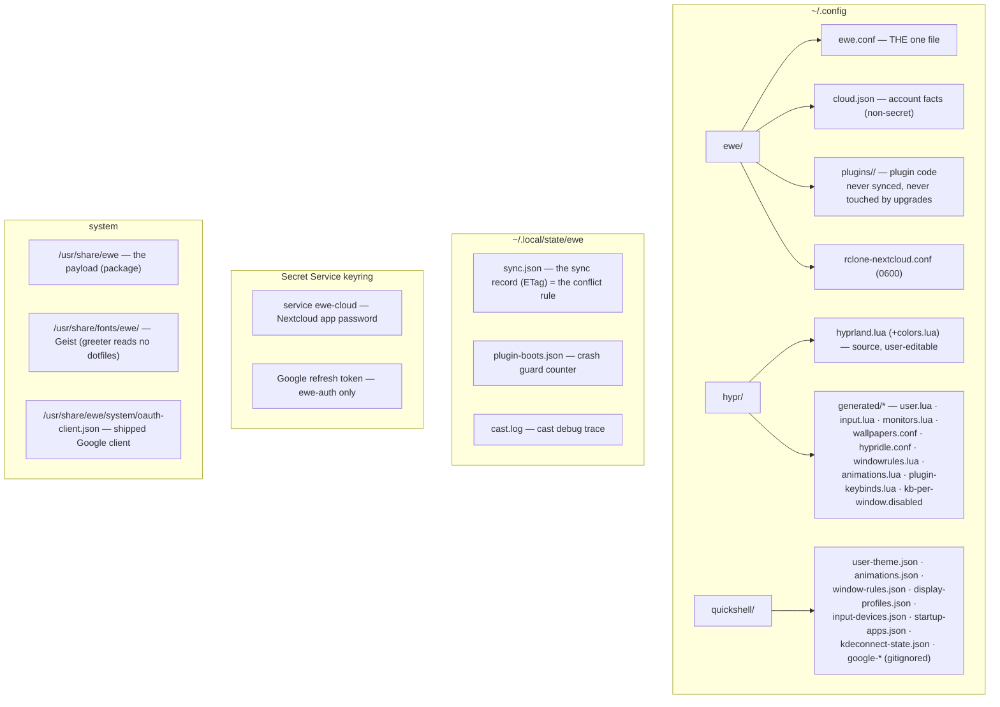

---
tags:
  - ewe-map
  - reference
title: Storage Map
up: "[[Home]]"
---

# Storage Map — where every byte lives

The complete file geography. "Generated" means: build artifact, never edit
by hand (rule 9, [[Rules of the House]]).

## Details worth memorising

- **User-state seeding**: `*.default` files (committed) seed their
  gitignored runtime counterparts only when missing
  (`user-theme.json`, `pinned-apps.json`, `places.json`,
  `hypr/generated/user.lua`). Edit the `.default`; never commit the runtime
  file.
- **systemd user units are copied, not symlinked** (the dotfile farm
  symlinks everything else; `link_tree` backs up real dirs to
  `<dest>.bak.<RUN_STAMP>` first).
- **Google caches** (`google-profile/events/mail.json` etc.) are
  non-secret and gitignored; the refresh token is keyring-only.
- **Nextcloud account layout** (remote): `ewe/ewe.conf`,
  `ewe/ewe.conf.meta.json`, `ewe/machines/<name>.json`; folder pairs
  anywhere in the account.
- **Plugin code is outside the payload** — upgrades never touch it; the
  payload's bundled copies are seeds (`ewe-plugin seed`), refreshed only on
  version change.
- **`.dev-mock/`** folders in the Tauri repos hold mock data for frontend
  work — not shipped.

## Related

- [[Contracts and Public API]] · [[The One File]] · [[Account and Sync]] ·
  [[Plugin System]]
