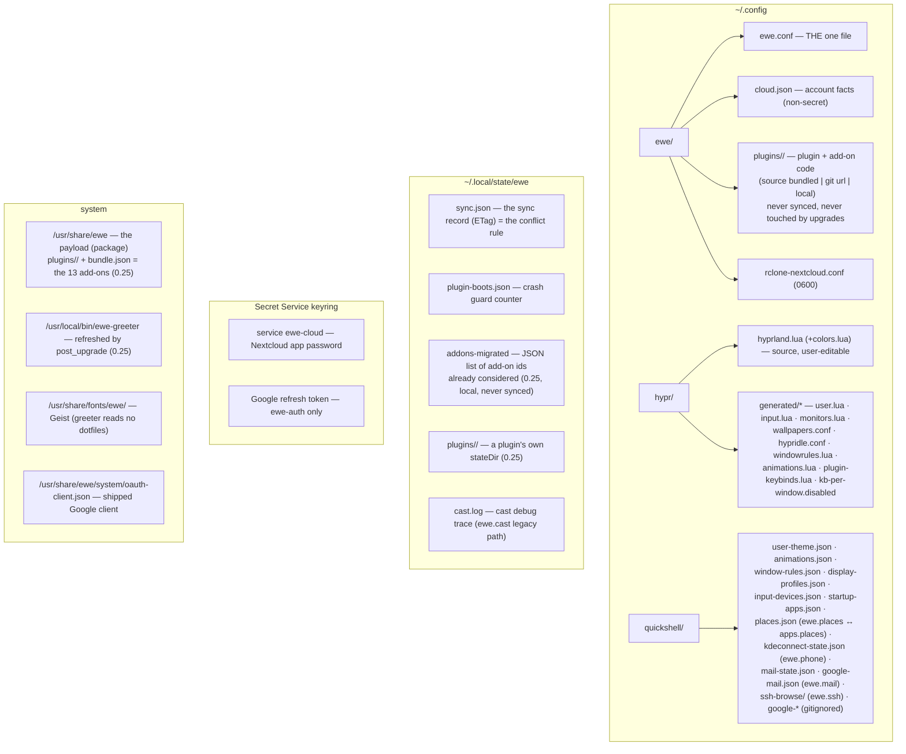

---
tags:
  - ewe-map
  - reference
title: Storage Map
up: "[[Home]]"
---

# Storage Map — where every byte lives

The complete file geography. "Generated" means: build artifact, never edit
by hand (rule 9, [[Rules of the House]]).

```mermaid
flowchart TB
    subgraph CFG["~/.config"]
        EWE["ewe/"] --> CONF["ewe.conf — THE one file"]
        EWE --> CLOUD["cloud.json — account facts (non-secret)"]
        EWE --> PLUGS["plugins/<id>/ — plugin + add-on code<br/>(source bundled | git url | local)<br/>never synced, never touched by upgrades"]
        EWE --> RCLONE["rclone-nextcloud.conf (0600)"]
        HYPR["hypr/"] --> HYPRLUA["hyprland.lua (+colors.lua) — source, user-editable"]
        HYPR --> GEN["generated/* — user.lua · input.lua · monitors.lua ·<br/>wallpapers.conf · hypridle.conf · windowrules.lua ·<br/>animations.lua · plugin-keybinds.lua · kb-per-window.disabled"]
        QS["quickshell/"] --> QSJ["user-theme.json · animations.json ·<br/>window-rules.json · display-profiles.json ·<br/>input-devices.json · startup-apps.json ·<br/>places.json (ewe.places ↔ apps.places) ·<br/>kdeconnect-state.json (ewe.phone) ·<br/>mail-state.json · google-mail.json (ewe.mail) ·<br/>ssh-browse/ (ewe.ssh) · google-* (gitignored)"]
    end
    subgraph STATE["~/.local/state/ewe"]
        SYNC["sync.json — the sync record (ETag) = the conflict rule"]
        BOOTS["plugin-boots.json — crash guard counter"]
        MIGR["addons-migrated — JSON list of add-on ids<br/>already considered (0.25, local, never synced)"]
        PSTATE["plugins/<id>/ — a plugin's own stateDir (0.25)"]
        CAST["cast.log — cast debug trace (ewe.cast legacy path)"]
    end
    subgraph KEYRING["Secret Service keyring"]
        KC["service ewe-cloud — Nextcloud app password"]
        KG["Google refresh token — ewe-auth only"]
    end
    subgraph SYSTEM["system"]
        PAY["/usr/share/ewe — the payload (package)<br/>plugins/<id>/ + bundle.json = the 13 add-ons (0.25)"]
        GREET["/usr/local/bin/ewe-greeter — refreshed by post_upgrade (0.25)"]
        FONTS["/usr/share/fonts/ewe/ — Geist (greeter reads no dotfiles)"]
        OAUTH["/usr/share/ewe/system/oauth-client.json — shipped Google client"]
    end
```

## Details worth memorising

- **User-state seeding**: `*.default` files (committed) seed their
  gitignored runtime counterparts only when missing
  (`user-theme.json`, `pinned-apps.json`, `places.json`,
  `hypr/generated/user.lua`). Edit the `.default`; never commit the runtime
  file.
- **systemd user units are copied, not symlinked** (the dotfile farm
  symlinks everything else; `link_tree` backs up real dirs to
  `<dest>.bak.<RUN_STAMP>` first).
- **Google caches** (`google-profile/events/mail.json` etc.) are
  non-secret and gitignored; the refresh token is keyring-only.
- **Nextcloud account layout** (remote): `ewe/ewe.conf`,
  `ewe/ewe.conf.meta.json`, `ewe/machines/<name>.json`; folder pairs
  anywhere in the account.
- **Plugin code is outside the payload** — upgrades never touch it; the
  payload's `plugins/<id>/` copies are the **plugins**, installed on
  request (`ewe-plugin install`), once for upgraders (`migrate`), refreshed
  only on version change ([[Add-ons — vendored payload and bundle.json]]).
- **Plugins keep the state paths the built-ins used** (`places.json`,
  `kdeconnect-state.json`, `mail-state.json`, `google-mail.json`,
  `ssh-browse/`) so an upgrade loses nothing; new plugin-private state goes
  in the injected `stateDir` (`~/.local/state/ewe/plugins/<id>/`).
- **`addons-migrated`** is per machine — it must never move into `ewe.conf`
  ([[Add-ons — one-time migration for upgraders]]).
- **`.dev-mock/`** folders in the Tauri repos hold mock data for frontend
  work — not shipped.

## Related

- [[Contracts and Public API]] · [[The One File]] · [[Account and Sync]] ·
  [[Plugin System]]
