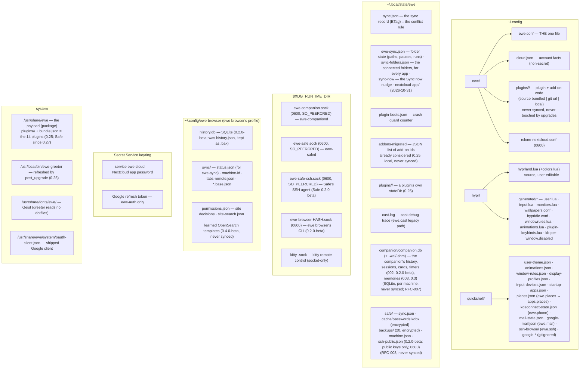

---
tags:
  - ewe-map
  - reference
title: Storage Map
up: "[[Home]]"
---

# Storage Map — where every byte lives

The complete file geography. "Generated" means: build artifact, never edit
by hand (rule 9, [[Rules of the House]]).

```mermaid
flowchart TB
    subgraph CFG["~/.config"]
        EWE["ewe/"] --> CONF["ewe.conf — THE one file"]
        EWE --> CLOUD["cloud.json — account facts (non-secret)"]
        EWE --> PLUGS["plugins/<id>/ — plugin + add-on code<br/>(source bundled | git url | local)<br/>never synced, never touched by upgrades"]
        EWE --> RCLONE["rclone-nextcloud.conf (0600)"]
        HYPR["hypr/"] --> HYPRLUA["hyprland.lua (+colors.lua) — source, user-editable"]
        HYPR --> GEN["generated/* — user.lua · input.lua · monitors.lua ·<br/>wallpapers.conf · hypridle.conf · windowrules.lua ·<br/>animations.lua · plugin-keybinds.lua · kb-per-window.disabled"]
        QS["quickshell/"] --> QSJ["user-theme.json · animations.json ·<br/>window-rules.json · display-profiles.json ·<br/>input-devices.json · startup-apps.json ·<br/>places.json (ewe.places ↔ apps.places) ·<br/>kdeconnect-state.json (ewe.phone) ·<br/>mail-state.json · google-mail.json (ewe.mail) ·<br/>ssh-browse/ (ewe.ssh) · google-* (gitignored)"]
    end
    subgraph STATE["~/.local/state/ewe"]
        SYNC["sync.json — the sync record (ETag) = the conflict rule"]
        FOLD["ewe-sync.json — folder state (paths, pauses, runs) ·<br/>sync-folders.json — the connected folders, for every app ·<br/>sync-now — the Sync now nudge · nextcloud-app/ (2026-10-31)"]
        BOOTS["plugin-boots.json — crash guard counter"]
        MIGR["addons-migrated — JSON list of add-on ids<br/>already considered (0.25, local, never synced)"]
        PSTATE["plugins/<id>/ — a plugin's own stateDir (0.25)"]
        CAST["cast.log — cast debug trace (ewe.cast legacy path)"]
        COMP["companion/companion.db (+ -wal/-shm) — the companion's history,<br/>sessions, cards, timers (002, 0.2.0-beta), memories (003, 0.3) (SQLite, per machine, never synced; RFC-007)"]
        SAFE["safe/ — sync.json · cache/passwords.kdbx (encrypted) ·<br/>backups/ (20, encrypted) · machine.json ·<br/>ssh-public.json (0.2.0-beta: public keys only, 0600)<br/>(RFC-008, never synced)"]
    end
    subgraph RUN["$XDG_RUNTIME_DIR"]
        CSOCK["ewe-companion.sock (0600, SO_PEERCRED) — ewe-companiond"]
        SSOCK["ewe-safe.sock (0600, SO_PEERCRED) — ewe-safed"]
        SSHSOCK["ewe-safe-ssh.sock (0600, SO_PEERCRED) — Safe's SSH agent (Safe 0.2.0-beta)"]
        BSOCK["ewe-browser-HASH.sock (0600) — ewe browser's CLI (0.2.0-beta)"]
        KSOCK["kitty-<pid>.sock — kitty remote control (socket-only)"]
    end
    subgraph BROWSER["~/.config/ewe-browser (ewe browser's profile)"]
        BHIST["history.db — SQLite (0.2.0-beta; was history.json, kept as .bak)"]
        BSYNC["sync/ — status.json (for ewe-sync) · machine-id ·<br/>tabs-remote.json · *.base.json"]
        BPRIV["permissions.json — site decisions · site-search.json —<br/>learned OpenSearch templates (0.4.0-beta, never synced)"]
    end
    subgraph KEYRING["Secret Service keyring"]
        KC["service ewe-cloud — Nextcloud app password"]
        KG["Google refresh token — ewe-auth only"]
    end
    subgraph SYSTEM["system"]
        PAY["/usr/share/ewe — the payload (package)<br/>plugins/<id>/ + bundle.json = the 14 plugins (0.25; Safe since 0.27)"]
        GREET["/usr/local/bin/ewe-greeter — refreshed by post_upgrade (0.25)"]
        FONTS["/usr/share/fonts/ewe/ — Geist (greeter reads no dotfiles)"]
        OAUTH["/usr/share/ewe/system/oauth-client.json — shipped Google client"]
    end
```

## Details worth memorising

- **User-state seeding**: `*.default` files (committed) seed their
  gitignored runtime counterparts only when missing
  (`user-theme.json`, `pinned-apps.json`, `places.json`,
  `hypr/generated/user.lua`). Edit the `.default`; never commit the runtime
  file.
- **systemd user units are copied, not symlinked** (the dotfile farm
  symlinks everything else; `link_tree` backs up real dirs to
  `<dest>.bak.<RUN_STAMP>` first).
- **Google caches** (`google-profile/events/mail.json` etc.) are
  non-secret and gitignored; the refresh token is keyring-only.
- **Nextcloud account layout** (remote): `ewe/ewe.conf`,
  `ewe/ewe.conf.meta.json`, `ewe/machines/<id>.json` (was `<name>.json`
  until the 2026-11-01 fix — two computers with one hostname overwrote each
  other), `ewe/remote/<id>.json` (RFC-009, discovery only); folder pairs
  anywhere in the account. `<id>` = first 16 hex of
  sha256("ewe:" + /etc/machine-id), the same in ewe-sync and ewe-remote.
- **Remote (RFC-009)**: `~/.local/share/ewe/remote/` (0700) holds
  `host_ed25519` (the sharing host key), `id_ed25519` (this computer's
  client key — never leaves it), `authorized_keys` (who may log in here;
  first line = the pairing key's forced command), `sshd_config` (generated
  every start), `code` (0600), `pairing.json` (fails/last), `computers.json`
  (who we paired with), `known_hosts` (pinned as `ewe-<id>`), `ssh_config`,
  `registry.json` (cache), `published.json`; runtime
  `$XDG_RUNTIME_DIR/ewe-remote/` (sshd pid, tunnels.json, ControlMaster
  sockets). Unit: `~/.config/systemd/user/ewe-remote-sshd.service` (copied by
  `lib/deploy.sh`, enabled only by `ewe-remote share on`).
- **Plugin code is outside the payload** — upgrades never touch it; the
  payload's `plugins/<id>/` copies are the **plugins**, installed on
  request (`ewe-plugin install`), once for upgraders (`migrate`), refreshed
  only on version change ([[Add-ons — vendored payload and bundle.json]]).
- **Plugins keep the state paths the built-ins used** (`places.json`,
  `kdeconnect-state.json`, `mail-state.json`, `google-mail.json`,
  `ssh-browse/`) so an upgrade loses nothing; new plugin-private state goes
  in the injected `stateDir` (`~/.local/state/ewe/plugins/<id>/`).
- **`addons-migrated`** is per machine — it must never move into `ewe.conf`
  ([[Add-ons — one-time migration for upgraders]]). The same goes for
  **`~/.local/state/ewe/default-apps-0.44.done`** (0.44): the marker of the
  one-time move from Nemo/Engrampa/imv/Zathura/mpv defaults to ewe Files /
  Viewer / Player in `~/.config/mimeapps.list` — local, never synced;
  delete it to re-run `_mime_take` ([[ewe's Own Apps — Files, Player, Viewer]]).
- **`.dev-mock/`** folders in the Tauri repos hold mock data for frontend
  work — not shipped.
- **Safe** ([[ewe-safe]]): the safe itself is one encrypted KDBX file in its
  place (`ewe/safe/passwords.kdbx` in the account, or
  `~/.local/share/ewe/safe/passwords.kdbx` for this computer only); its
  per-machine cache, backups and `sync.json` live in
  `~/.local/state/ewe/safe/`; its non-secret settings are `[safe]` in
  `ewe.conf`. The master password is never stored.
- **Safe's SSH agent** (Safe 0.2.0-beta, released 2026-10-15):
  `ssh-public.json` in `~/.local/state/ewe/safe/` lets the agent list keys
  while the safe is locked (public keys and titles only, written only while
  the agent is on); `ewe-safe ssh enable` writes
  `~/.config/environment.d/90-ewe-safe-ssh.conf` (`SSH_AUTH_SOCK`). The
  private keys stay inside the KDBX file. **Since Safe 0.4.0-beta (the SSH
  gate, building):** two lines on top of `~/.ssh/config` (`Include
  ~/.ssh/ewe-safe/config`; a one-time `~/.ssh/config.before-safe`) and
  Safe's own `~/.ssh/ewe-safe/` (`config` = `Host *` → Safe's agent +
  `known_hosts`; `key-<tag>.pub` public key files; `known_hosts` of GitHub,
  GitLab, Bitbucket, Azure DevOps, Codeberg; `allowed_signers` for commit
  signing); `ssh-used.json` (last use per key: fingerprint, time, program)
  in `~/.local/state/ewe/safe/`. Rebuilt on every computer from the safe.
- **Safe's login unlock and keyring** (Safe 0.3.0-beta, 2026-10-18), all
  in `~/.local/state/ewe/safe/`, `0600`, never synced: `login.key` (W under
  Argon2id of the login password), `master.wrap` (the master password under
  W, only while login unlock is on), `keyring.safe` + `keyring.index` and
  the marker `keyring.on` (only after the parked `keyring adopt`). The
  carrier is one item in gnome-keyring's `login` keyring ("Safe — unlock key
  for this computer", `application=ewe-safe`). Cards and addresses live in
  the KDBX file like every item.
- **ewe browser** keeps its profile in `~/.config/ewe-browser/` (not
  `ewe.conf`). Its `downloads.json` (`{version: 1, entries: [{id, url,
  filename, path, mime, received, total, speed, status, started, ended}]}`,
  newest first, ms, ≤ 200, atomic writes ≤ 1/s) is **read by the dock**
  since Dock 1.2.0 — a cross-repo contract: keep the path and the fields.
  The dock's "Clear" mark is `~/.local/state/ewe/dock-downloads.json`
  (`{clearedAt: ms}`, local, never synced). Synced through the account: `ewe/browser/bookmarks.json`,
  `history.json` (with clear records since 0.2.0-beta), `settings.json`,
  and `tabs-<id>.json` per machine (since 0.2.0-beta). See
  [[Browser History — SQLite, synced clear records]]. Since 0.4.0-beta the
  profile also holds `permissions.json` (Allow / Block per top-level site,
  1000 origins — [[Site Permissions — ask per site]]) and
  `site-search.json` (OpenSearch templates learned on visited pages, 500
  hosts); neither syncs, nor do the Privacy and security settings.
- **The companion keeps its own state** in `~/.local/state/ewe/companion/`
  (`companion.db`, 30-day retention), not in `ewe.conf`: history is per
  machine. Since 0.2.0-beta it also keeps timers and reminders there
  (migration `002_timers`, 50 waiting at most), so they survive a restart.
  What the user asks Shaun to remember is `003_memory` (0.3, 100 at most,
  secrets refused); it goes to the chosen provider with each question.
  The user's own notes for Shaun are plain files in `~/Documents/Shaun`
  (0.3.0-beta, `EWE_COMPANION_NOTES`; `.md`/`.txt`, written by the user or
  by "learn this: …"): Shaun reads and indexes them, never syncs them. Its synced, non-secret prefs are `[companion]` in `ewe.conf`
  (`ewe-conf` domain `companion`, applies nothing); API keys (P4) go in the
  keyring, never the file.

## The file picker (0.48, released 2026-11-22)

- **Routing is per user**: `~/.config/xdg-desktop-portal/hyprland-portals.conf`
  (a link into the payload), `~/.local/share/xdg-desktop-portal/portals/ewe.portal`,
  `~/.local/share/dbus-1/services/org.freedesktop.impl.portal.desktop.ewe.service`,
  `~/.config/systemd/user/ewe-portal.service`, `~/.local/bin/ewe-portal` — all
  from `deploy_portal`, no root. A request lives in
  `$XDG_RUNTIME_DIR/ewe-portal/<id>.json` until answered; what the picker
  remembers (last folder per app, list or grid, hidden files, sort) is
  `~/.local/state/ewe/filepicker.json` — local, never synced
  ([[RFC-011 — One File Picker]]).

## The media + languages wave (0.46, released 2026-11-21)

- **fcitx5** (only once someone adds a language): `~/.config/fcitx5/`
  (`profile`, `config`, `conf/classicui.conf`, `conf/pinyin.conf`) and
  `~/.local/share/fcitx5/themes/ewe/` — written by `ewe-ime apply`;
  `~/.config/hypr/generated/ime.env`; a marked block in the
  Chromium/Electron `*-flags.conf` files; `~/.cache/ewe/ime-sizes.json`.
  `[desktop.ime]` in ewe.conf is the truth; everything else is regenerated.
- **Spelling:** `[desktop.language]` in ewe.conf; dictionaries in
  `/usr/share/hunspell` (packages); ewe Browser's `.bdic` files and
  `spelling-ignored.json` in `~/.config/ewe-browser/`.
- **Caches:** `$XDG_CACHE_HOME/ewe/desktop-entries/applications/` (LF copies
  of CRLF `.desktop` files), `$XDG_CACHE_HOME/ewe-apps/pictures/` (HEIC as
  JPEG, LRU 512 MB).
- **Not ewe's, written by Komble on request:**
  `~/.config/stremio-enhanced/streamingserver/server.js`.
- The locale (display language, Formats) is `/etc/locale.conf` —
  `localectl`, never ewe.conf.

## Related

- [[Contracts and Public API]] · [[The One File]] · [[Account and Sync]] ·
  [[Plugin System]]

## ewe Mobile and the phone (0.2, 2026-11-26)

| Path | What |
|---|---|
| `$XDG_CACHE_HOME/ewe-mobile/<deviceId>/apps.json` + `icons/<package>.png` | the phone's apps (contract C2) — written by ewe Mobile and the ewe.phone bridge, read by the dock popup, the launcher entries and the Apps page; cache, atomic, an app that left the list loses its icon |
| `~/.local/share/applications/ewe-mobile-app-<package>.desktop` · `ewe-mobile-screen.desktop` | the phone's apps as launcher entries (C4), `X-Eep-Skip=true`, `X-Ewe-Mobile-App=<deviceId>`; ewe Mobile deletes them when the app leaves the list or the phone is unpaired |
| `~/.local/share/applications/` copies marked `X-Ewe-Phone-Hides=1`; `~/.local/state/ewe-phone/backup/` | KDE Connect's hidden launcher entries (`hide_kdeconnect`) and a user's own entry of the same name, kept byte for byte; `show` puts everything back |

## eep (0.1 / 0.2)

| Path | What |
|---|---|
| `~/Applications/*.eep` | the cards — eep's apps and (0.2) every found app; the user's |
| `~/.local/state/eep/` | `roots/` (GC roots), `lock`, the crash journal, `found.json` (found apps: `{id: {entry, hidden}}`) |
| `~/.local/share/eep/` | `icons/`, `bin/` + `shims/` (PATH), `hidden/` (a user's own launcher entries while their app is hidden) |
| `~/.local/share/applications/*.desktop` with `X-Eep-Id` / `X-Eep-Hides` | eep's launcher entries / the copies that hide found apps |
| `~/.cache/eep/` | index, icons cache, `updates.json` |
| `/var/cache/eep/local` (1777), `/var/tmp/eep/<uid>` (0700, 0.2) | the local binary cache for patched pieces; each user's private patch scratch space |
| `/var/lib/eep/opengl-driver` → `/run/opengl-driver` | the Mesa driver farm for Nix apps (root's driver timer) |

## ewe Mail (2026-11-27 — ewe Mail 0.1.0-beta, ewe 0.51.0-beta)

| Path | What |
|---|---|
| `$XDG_CACHE_HOME/ewe-mail/mail.sqlite` | the app's cache: conversation rows, the Gmail `historyId` / IMAP `UIDVALIDITY` + highest UID per folder, the last 500 opened messages (parsed), people seen, trusted senders. Deleting it loses only time; an account that left the list has its rows dropped at the next start |
| `$XDG_CACHE_HOME/ewe-mail/open/<random>/` | an attachment opened with "Open" (mode 0600, cleaned name); never a runnable type |
| `ewe.conf` `accounts.mail` · `[mail]` | the accounts (no password) and ewe Mail's three settings, through `ewe-conf` (store-only domains) |
| keyring `service ewe-mail host <host> user <user>` (SMTP: `host <smtp_host> user <smtp_user>`) | the mailbox passwords; read by the app with `secret-tool`, kept in Rust memory only |
| the webview's localStorage | unsent drafts (a per-viewer convenience, nothing else) |
| `~/.config/quickshell/mail-state.json` · `google-mail.json` | still the **plugin's** (cursors, the notified set); the app does not read them |

See [[ewe Mail]].
