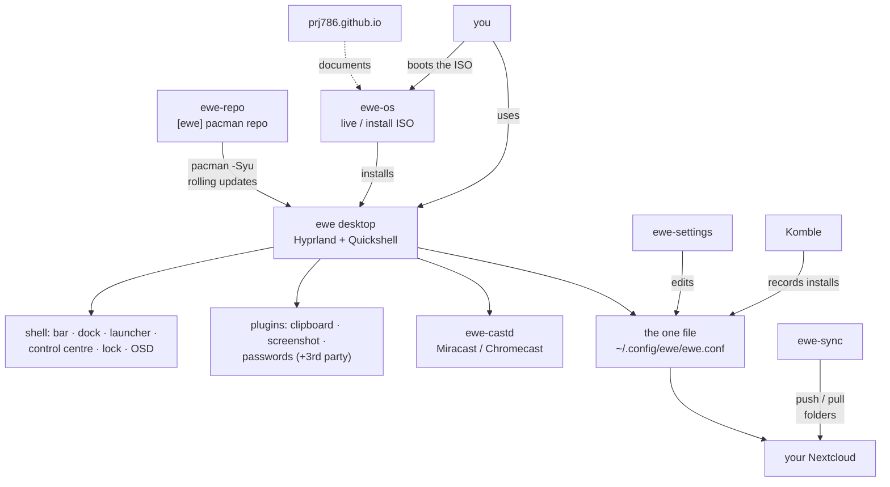

---
tags:
  - ewe-map
  - hub
title: Home
---

# Home — the ewe project map

**ewe** *(the sheep)* is an Arch-based **operating system** built by
[scubba](https://github.com/prj786): a full desktop environment (Hyprland +
Quickshell), a software manager, a settings app, an account/sync app, a
casting daemon, its own pacman repository, an installable ISO and a website.
The whole project lives in `/home/scubba/Projects/ewe/`.

> One-line summary: **a themed, dark, Wayland desktop that treats the whole
> machine as one file (`ewe.conf`), syncs that file through your own
> Nextcloud, and installs itself from a custom ISO.**

> **Here to work on ewe?** Start at [[00 Onboarding]], then
> [[Rules of the House]] and [[Decision Index]].

## The big picture

## Index

**Start here**
- [[00 Onboarding]] — the guide for anyone (or anything) working on ewe

**01 — Overview**
- [[What is ewe]] — the pitch, in detail
- [[Repository Map]] — the 8 repos + 4 plugin repos and how they relate
- [[Roadmap and Status]] — versions, RFCs, what's shipping vs planned
- [[Glossary]] — Quickshell, layer-shell, Komble, the one file, …

**02 — Architecture**
- [[System Architecture]] — layers, from ISO to keyring
- [[Desktop Shell]] — Hyprland + Quickshell anatomy
- [[Shell Singletons]] — Globals, Theme, AudioState, HyprMon, BtAgent, phone bridge
- [[The One File]] — `ewe.conf`, RFC-001
- [[Account and Sync]] — Nextcloud account, RFC-005/006
- [[Auth Broker]] — `ewe-auth`, tokens, Google as optional extra
- [[Packaging and Updates]] — ewe-repo publish pipeline

**03 — Components** (one note per repo)
- [[ewe Desktop]] · [[ewe-os ISO]] · [[ewe-repo]] · [[Komble]] ·
  [[ewe-settings]] · [[ewe-sync]] · [[ewe-cast]] · [[Website]]
- [[Google Extras]] · [[Phone and VPN]] — the optional integrations

**04 — Plugins**
- [[Plugin System]] · [[Clipboard Plugin]] · [[Screenshot Plugin]] ·
  [[Passwords Plugin]] · [[Example Plugin]]

**05 — Workflows**
- [[Install Flow]] · [[Update Flow]] · [[Cast Flow]] ·
  [[Sync and Backup Flow]] · [[Settings Flow]]

**06 — Design**
- [[Design System]] · [[Theming Pipeline]] · [[Mockups and Screenshots]]

**07 — Development**
- [[Repo Layout]] · [[CLI Tools]] · [[Worktrees and Screenshots]]

**08 — Decisions** (the "why" — don't relitigate)
- [[Decision Index]] · [[Foundation Choices]] ·
  [[RFC-001 — The One File]] · [[RFC-005 — Nextcloud Account]] ·
  [[RFC-006 — ewe-sync App]] · [[RFC-002 — Auth Broker]] ·
  [[RFC-004 — ewe-castd, Python not Rust]] ·
  [[Process Split — Shell vs Apps]] · [[Plugins Unsandboxed]] ·
  [[Komble — Arch Forced Decisions]] · [[Unsigned Repo — for now]] ·
  [[Parked and Rejected Ideas]]

**09 — Rules** (the contracts)
- [[Rules of the House]] · [[Contracts and Public API]] · [[Security Posture]]

**10 — Roadmap** (what's next)
- [[Roadmap — Desktop and One File]] · [[Roadmap — Komble]] ·
  [[Roadmap — ewe-sync]] · [[Roadmap — ewe-cast]] ·
  [[Roadmap — Distro and Repo]] · [[Open Questions]]

**11 — How we work**
- [[Development Loops]] · [[Testing and QA]] · [[Release Checklist]] ·
  [[Conventions]] · [[Troubleshooting Knowledge]]

**12 — Reference** (the sheets)
- [[Quick Answers]] — the 30 top questions, answered in one line each
- [[IPC Verb Reference]] · [[EWE-CONF Schema Reference]] ·
  [[Keymap Reference]] · [[Plugin Manifest Reference]] ·
  [[Storage Map]] · [[Version Ledger]]
